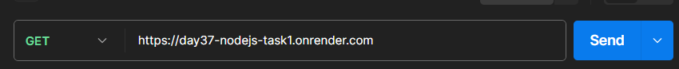
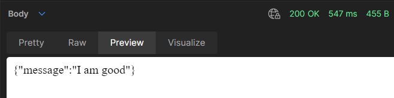
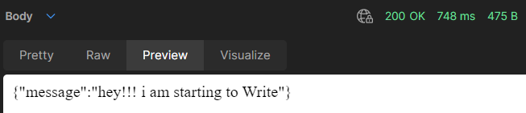

# :rocket: IN THIS REPOSITORY

### Time Stamp in NodeJs

### you can see output 🎈[Render.com](https://day37-nodejs-task1.onrender.com)
### For writing ➡ end point `/write` ➡ [https://day37-nodejs-task1.onrender.com/write](https://day37-nodejs-task1.onrender.com)
### For reading ➡ end point `/read` ➡ [https://day37-nodejs-task1.onrender.com/read](https://day37-nodejs-task1.onrender.com) 
+ Installing express as third party 
```
 📎install express
```
+ And also install nodemon for live rendering 
```
📎install nodemon
```
+ import Default package Filesystem in nodejs
```javascript
import fs from 'fs';
```
***Checked in `Postman`:***








